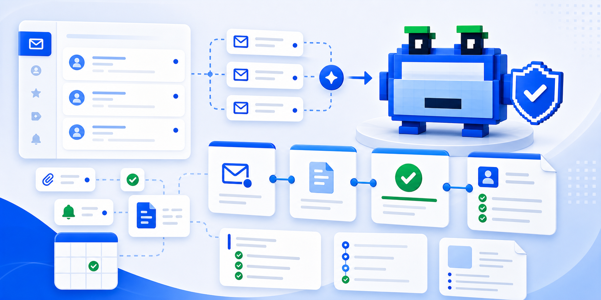
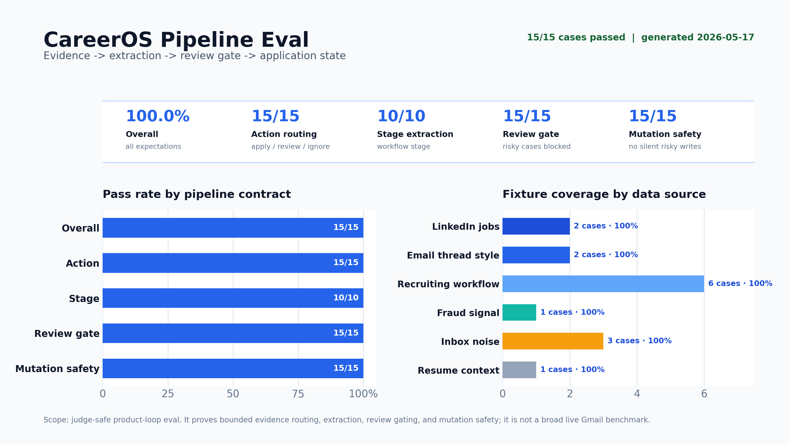
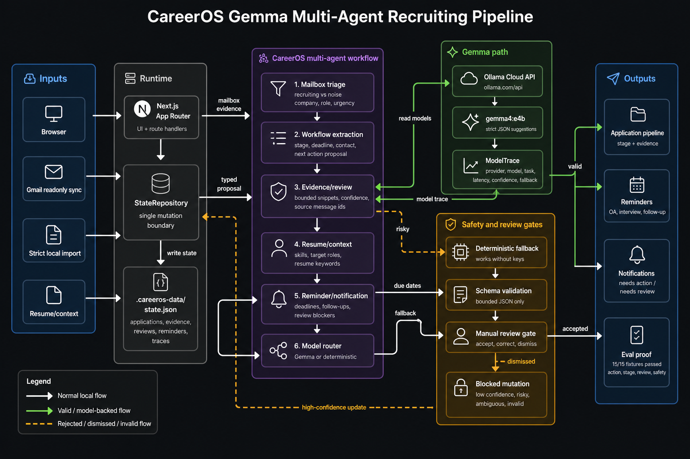

# CareerOS

[](https://github.com/hskl18/public-careeros/actions/workflows/public-ci.yml)



CareerOS is the public Gemma hackathon demo of the CareerOS / Other Candidate
recruiting inbox pipeline. It is a judge-facing local demo/source repo, not the
full hosted Other Candidate codebase.

**This is not a generic chatbot.** It is a recruiting mailbox pipeline:
bounded email evidence -> extraction -> review gate -> application state,
reminders, and notifications.

Other Candidate is a Gemma 4 powered multi-agent recruiting mailbox pipeline,
not another chatbot.

Project links:

- [Public judge demo](https://public-careeros.vercel.app/judge-demo)
- [Hosted product](https://www.careeroc.com)
- [Source repository](https://github.com/hskl18/public-careeros)

Run it with:

```bash
pnpm install
pnpm dev
```

Then open `http://localhost:3000/judge-demo` for the credential-free judge
demo. No Gmail account, Ollama Cloud key, hosted database, Docker runtime, or
model download is required to inspect the full agentic workflow.

What judges should see immediately:

- sanitized mailbox evidence
- Gemma via Ollama Cloud as the optional model path
- deterministic fallback when no key is configured
- evidence -> extraction -> review gate -> application/reminder loop
- model traces and review gates instead of a generic chatbot transcript

## Kaggle Judge TL;DR

| Judging signal | What this repo proves |
| --- | --- |
| Real-world impact | Job-search state is trapped in recruiting email; CareerOS turns it into reminders, application stages, and reviewable actions. |
| Gemma depth | Gemma is used for bounded triage, workflow extraction, evidence review, resume/context analysis, and notification summaries, not open-ended chat. |
| Safety & trust | Risky updates stop at review gates; traces keep model path, confidence, evidence, and fallback without storing raw Gmail bodies or provider keys. |
| Reproducibility | `pnpm install && pnpm dev` opens `/judge-demo` with no credentials, and `pnpm eval:pipeline` regenerates the 15/15 pipeline proof graph. |
| Demo quality | The judge path shows the full loop: mailbox evidence -> agent extraction -> review gate -> application/reminder/notification output. |

## Eval Proof



`pnpm eval:pipeline` runs 15 judge-safe fixtures mapped to public dataset
components from Enron email, SpamAssassin email classification, LinkedIn job
postings, resume NLP data, and fake-job-posting data. Current result:
**15/15 passed** across action routing, stage extraction, review-gate behavior,
and mutation safety.

The eval writes machine-readable results to `eval/results.json` and renders the
graph with `tools/render_eval_graph.py` using Python/matplotlib. If a local
machine does not have matplotlib, run `python3 -m pip install matplotlib` before
regenerating the graph. GitHub Actions installs it before `pnpm ci:public`.

This is intentionally not claimed as a broad ML benchmark. It is a product-loop
eval for the hackathon claim: bounded mailbox evidence becomes extracted
application state only when the pipeline can classify it safely, and risky
updates stop at review.

## 20-Second Judge Path

1. Clone the repo and run `pnpm install && pnpm dev`.
2. Open `http://localhost:3000/judge-demo`.
3. Watch the sanitized recruiter thread become an extracted application update.
4. Check the trace panel: Gemma via Ollama Cloud is the model path,
   deterministic fallback is visible, and risky state changes stop at the
   review gate.
5. Open `/agents` for the agent contracts and can/cannot-do boundaries.

## Public Vercel Demo

The judge-facing deployment should be public and credential-free:

- deploy the Next.js app to Vercel with public access
- set no Gmail OAuth values unless you intentionally want live Gmail sync
- set no `OLLAMA_API_KEY` unless you intentionally want live Gemma checks
- keep `/judge-demo` as the primary Kaggle link
- optionally set `NEXT_PUBLIC_SITE_URL=https://your-vercel-domain`

The app is safe to deploy without keys. On Vercel, workspace state falls back
to ephemeral `/tmp/.careeros-data` storage unless `CAREEROS_DATA_DIR` is set,
so the public demo can render without a database or writable repo directory.
Without `OLLAMA_API_KEY`, model status shows deterministic fallback; the video
or local `pnpm smoke:ollama` can separately prove the live Ollama Cloud path.

Runtime pinning:

- `package.json` uses `"engines": { "node": "24.x" }` so Vercel stays on
  Node 24 instead of auto-upgrading to a future major Node release.
- `.node-version` also pins local and CI tooling to Node 24.

## Pipeline Diagram

This diagram is a compact readme/reference asset for the technical flow. It is
not used as the app hero.



CareerOS turns recruiting email into structured application state with a
multi-agent workflow. It is intentionally still the CareerOS pipeline, not a
plain job dashboard:

1. Mailbox triage
2. Workflow extraction
3. Evidence and review gate
4. Resume/context analysis
5. Reminder and notification generation
6. Model routing through Gemma via Ollama Cloud

The hosted product is **Other Candidate** at `careeroc.com`. This repo is the
open-source hackathon demo: one Next.js app, local JSON state, optional Gmail
readonly sync, optional Ollama Cloud/Gemma analysis, deterministic fallback,
and no separate backend stack.

## Agent Contract

The public demo keeps the original CareerOS operating model:

| Agent layer | Can do | Cannot do |
| --- | --- | --- |
| Mailbox triage | Classify recruiting relevance, urgency, company, role, and action from bounded mailbox snippets | Store full inbox bodies or mutate application state |
| Workflow extraction | Propose typed application updates such as OA, interview, rejection, offer, deadline, or follow-up | Apply model output directly |
| Evidence/review | Attach bounded evidence, confidence, source message ids, and block risky/model-backed changes | Hide low-confidence changes from the user |
| Resume/context | Use local target roles, skills, preferences, and resume keywords as candidate context | Upload resume text to hosted providers in this demo |
| Reminder/notification | Derive due dates, follow-ups, review blockers, connector health, and model status from reviewed state | Become a second source of truth |
| Model router/provider | Use deterministic fallback first, or Gemma through Ollama Cloud when `OLLAMA_API_KEY` is configured | Store provider keys in workspace state, auto-download models, or mark roadmap providers as shipped |

Prompt and memory boundaries:

- Gemma prompts use bounded snippets and ask for strict JSON.
- Model output is schema-validated and review-gated before mutation.
- Agent memory is local state: applications, bounded evidence, review items,
  candidate context, compact correction facts, model traces, and notifications
  under `.careeros-data`.
- Review corrections feed back as compact local memory facts. Later imports and
  Gemma prompts can use those hints, but they still cannot bypass validation or
  review gates.
- Model traces keep provider, model tag, task, latency, confidence, fallback,
  and bounded diagnostics. They do not store raw prompts, raw responses, full
  Gmail bodies, OAuth tokens, or provider keys.
- First run has zero model cost and starts as a clean workspace. Connect
  readonly Gmail to create real pipeline records; use `/judge-demo` for the
  sanitized sample story without touching local workspace state.

## Quick Start

```bash
pnpm install
pnpm dev
```

Open:

```text
http://localhost:3000
```

First run opens a clean workspace. To process your real job pipeline, configure
Gmail OAuth, connect readonly Gmail, then sync recruiting mail. To see the
sanitized Kaggle story without credentials or local workspace writes, open
`/judge-demo`.

## Optional: Gemma Through Ollama Cloud

CareerOS calls the Ollama Cloud API from the Next.js server. Users do not set
up a desktop model runtime. Create an Ollama Cloud API key, then create
`.env.local`:

```bash
CAREEROS_OLLAMA_ENABLED=true
CAREEROS_OLLAMA_BASE_URL=https://ollama.com
CAREEROS_GEMMA_MODEL=gemma4:31b
OLLAMA_API_KEY=your-ollama-cloud-api-key
```

Restart `pnpm dev`, then open `/settings` and click **Save and verify Ollama Cloud API**.

This demo allows only the Ollama Cloud base URL `https://ollama.com`; server
code derives API calls under `https://ollama.com/api`.

For a real key-backed smoke test without starting the app:

```bash
pnpm smoke:ollama
```

`pnpm smoke:ollama` reads `.env.local` when present. Without an API key it
passes the public no-key gate with a `skipped_no_key` diagnostic; with a key it
checks the configured Gemma model through Ollama Cloud.

Mental model:

- `http://localhost:3000` is the CareerOS Next.js app.
- `https://ollama.com/api` is the remote Ollama Cloud API.
- The browser never sees `OLLAMA_API_KEY`; server routes read it from
  `.env.local`, call Ollama Cloud, validate JSON, and send proposals to review.

## Optional: Gmail Readonly Sync

Create a Google OAuth Web Application client:

- Authorized JavaScript origin: `http://localhost:3000`
- Authorized redirect URI:
  `http://localhost:3000/api/connectors/gmail/callback`
- Scope used by this demo: `https://www.googleapis.com/auth/gmail.readonly`

Add the local env values:

```bash
CAREEROS_GMAIL_CONNECTOR_ENABLED=true
CAREEROS_GMAIL_CLIENT_ID=your-google-oauth-client-id
CAREEROS_GMAIL_CLIENT_SECRET=your-google-oauth-client-secret
CAREEROS_GMAIL_REDIRECT_URI=http://localhost:3000/api/connectors/gmail/callback
CAREEROS_GMAIL_QUERY='newer_than:90d (recruiter OR application OR assessment OR interview OR "next steps" OR offer OR OA)'
CAREEROS_GMAIL_MAX_RESULTS=10
```

Restart `pnpm dev`, open `/settings?section=gmail`, and confirm the **Google
callback URL** shown in the app exactly matches the Google OAuth **Authorized
redirect URI**. `localhost`, `127.0.0.1`, port, and path must be identical.
Then click **Connect Gmail**, finish Google OAuth, and click **Sync recruiting
mail**.

Token boundary: the Gmail token is stored as an AES-GCM envelope at
`.careeros-data/gmail-oauth.json`, using `CAREEROS_TOKEN_SECRET`,
`CAREEROS_SECRET_KEY`, or the configured Gmail client secret as key material.
Sync requests readonly Gmail metadata/snippets and converts those bounded
snippets into import records; full Gmail bodies are not persisted. Sync uses
small bounded pagination, suppresses already imported message source labels,
merges new messages into local threads, and writes compact local audit events.
That directory is gitignored. The OAuth callback validates local state and only
returns sanitized settings-page statuses; provider raw errors are not shown. Do
not commit real `.env.local`, Gmail data, screenshots with private email, or
local state.

## Routes

| Route | Purpose |
| --- | --- |
| `/` | Local pipeline console |
| `/judge-demo` | Kaggle judge story and agent handoff demo |
| `/agents` | Agent contracts, local memory, prompting, and runtime boundaries |
| `/applications` | Application state and mailbox evidence |
| `/applications/[id]` | Application detail, timeline, evidence, review blockers |
| `/review` | Accept, dismiss, or correct review-gated updates |
| `/resume` | Deterministic + optional Gemma resume analysis |
| `/notifications` | Local notification queue |
| `/settings` | Ollama Cloud/Gemma, Gmail, local data, imports |
| `/api/pipeline` | Inspectable multi-agent pipeline JSON |
| `/api/providers` | Implemented/roadmap model provider metadata |
| Metrics API | Local effort metrics for future reporting surfaces |

## Repo Structure

```text
app/              Next.js App Router pages and route handlers
components/       Small reusable UI components
styles/           Layered global CSS split by surface and responsibility
lib/              Pipeline, persistence, provider, Gmail, review, and view helpers
lib/agent-constraints.ts
                  Machine-readable handoff, guardrail, prompt, trace, and review-gate constraints
public/           Agent and mascot SVG assets served by the app
docs/             Architecture, release, writeup, and submission docs
docs/media/       Curated judge/Kaggle media assets
eval/             Pipeline eval fixtures and generated results
tools/            Local validation and smoke-test entrypoints
tests/            Vitest coverage for pipeline, routes, persistence, and safety
scripts/          Public-release safety checks
```

## Local Data

Default state is stored in:

```text
.careeros-data/state.json
```

Use `/settings?section=local-data` to export, import, or delete local data.
Delete requires the exact confirmation phrase. You can also delete
`.careeros-data` while the dev server is stopped; the next app read recreates
an empty workspace.

## Commands

```bash
pnpm dev       # run the local Next.js app
pnpm check     # TypeScript
pnpm test      # Vitest
pnpm build     # production build
pnpm smoke:browser # headless Chrome route/layout smoke
pnpm smoke:ollama  # no-key public gate, or live Ollama Cloud smoke with OLLAMA_API_KEY
pnpm eval:pipeline # dataset-mapped pipeline eval + graph output
pnpm ci:public # public CI gate without requiring provider secrets
pnpm release:check # public safety + check + test + build + browser + Ollama + diff check
pnpm run ci    # check + test + build
```

## Public Safety

Before publishing, verify:

- No real `.env*` files except `.env.example`
- No `.careeros-data`, local DBs, Gmail exports, OAuth tokens, or screenshots
  with private email
- No hosted provider dashboard URLs or local machine paths

## Docs

- [Security](SECURITY.md)
- [Architecture](docs/architecture.md)
- [API spec](docs/api-spec.md)
- [Browser smoke and screenshot proof](docs/browser-smoke.md)
- [Pipeline eval proof](docs/eval.md)
- [Gemma pipeline diagram](docs/media/architecture.png)
- [Design](docs/design.md)
- [Public media assets](docs/media/)
- [Hackathon writeup](docs/hackathon-writeup.md)
- [Roadmap](docs/roadmap.md)
- [Release summary](docs/release-summary.md)

## License

MIT — see [LICENSE](LICENSE).
