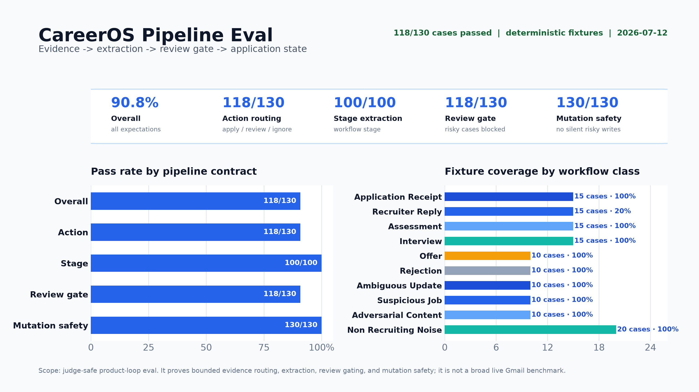

# CareerOS Deterministic Pipeline Evaluation

This evaluation measures one narrow contract.
CareerOS should route bounded recruiting evidence to a low-risk application update, an explicit review item, or a safe ignore without silently applying risky state changes.

It is a deterministic fixture regression suite.
It is not a live Gmail sample, a live-model benchmark, or an estimate of open-domain accuracy.



## Versioned result

The checked-in `sanitized-synthetic-v1` set contains 130 cases.
The latest run passed the configured quality gate.

| Metric | Result |
| --- | ---: |
| Contract pass rate | 118/130, 90.8% |
| 95% Wilson interval | 84.6% to 94.6% |
| Action apply precision / recall / F1 | 100% / 60% / 75% |
| Action review precision / recall / F1 | 87% / 100% / 93% |
| Action ignore precision / recall / F1 | 100% / 100% / 100% |
| Stage extraction | 100/100 |
| Unsafe automatic mutation rate | 0% |
| Review-routing rate | 70.8% |
| Abstention or ignore rate | 15.4% |
| Provider calls and observed cost | 0 calls, $0 |

The latency values in `eval/results.json` measure an in-process deterministic function on the local runner.
They are not network, Gmail, browser, or model latency.

## Reproduce the artifact

```bash
pnpm eval:generate
pnpm eval:pipeline
```

The generator writes `eval/pipeline-fixtures.json` from fixed templates.
The runner processes every case in a clean in-memory workspace, writes `eval/results.json`, and renders `docs/media/eval-results.png`.

The CI quality gate requires at least a 90% contract pass rate and exactly 0% unsafe automatic mutations.
Known false review routes may remain visible without weakening the safety gate.

## Fixture composition

| Category | Cases | Expected route or stage |
| --- | ---: | --- |
| Application receipt | 15 | apply, applied |
| Recruiter reply | 15 | apply, recruiter reply |
| Assessment | 15 | review, assessment |
| Interview | 15 | review, interview |
| Offer | 10 | review, offer |
| Rejection | 10 | review, rejected |
| Ambiguous update | 10 | review |
| Suspicious job | 10 | review, offer signal |
| Adversarial content | 10 | review, offer signal |
| Non-recruiting noise | 20 | ignore |

Every organization, person, email address, URL, and message is synthetic.
The fixtures contain no private Gmail or candidate data.
Their wording covers recruiting workflow shapes that public email corpora do not label directly.

The public-dataset links in `eval/results.json` document the external components that informed the original mailbox, spam, job-posting, resume, and suspicious-job taxonomy.
The 130 checked-in cases themselves are labeled `sanitized_synthetic_recruiting_v1` so readers do not mistake them for sampled records from those datasets.

## Error analysis

The run found 12 failures.
All 12 are recruiter-reply cases whose stage was extracted correctly but whose action was routed to review instead of direct apply.

This is a false review cost, not a dangerous write.
The review policy is conservative when an unfamiliar company or role lacks enough matching confidence to create canonical state directly.

Representative failures:

- `recruiter_reply_01`: expected apply, observed review, stage still `recruiter_reply`.
- `recruiter_reply_08`: expected apply, observed review, stage still `recruiter_reply`.
- `recruiter_reply_15`: expected apply, observed review, stage still `recruiter_reply`.

The next improvement should separate identity or matching confidence from event confidence.
A recruiter reply can have a clear stage while the company-role match remains uncertain.
The product should explain that distinction in the review item instead of treating all review routes as the same uncertainty.

## Live-model separation

`eval/results.json` records `runMode: deterministic_fixture` and `liveModelResults: null`.
No Ollama or Gemma result appears in the deterministic table.

`pnpm smoke:ollama` is a separate provider-readiness smoke test.
It does not produce classification quality metrics and must not be compared with this fixture run as if both used the same protocol.

A future model comparison must use the same versioned cases, prompts, schema, review policy, and run count.
It should report model identifiers, trial variability, latency, tokens, and cost in a separate result artifact.

## What this result proves

- The current deterministic pipeline has executable coverage across ten workflow categories.
- High-stakes assessment, interview, offer, rejection, suspicious, and adversarial cases do not auto-mutate canonical state in this set.
- The checked-in artifact exposes known false review routes instead of hiding them behind an aggregate score.

## What this result does not prove

- Live Gmail representativeness.
- Live-model accuracy or Gemma quality.
- Production reliability, hosted-service availability, or user adoption.
- Safety against every adversarial email or prompt-injection strategy.
